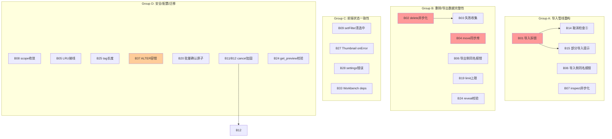

# 茶包素材 BagerTea V2 — 第二批全量修复计划

- 文档编号：fix-plan-batch2-2026-08-14
- 作者：高见远（Architect）
- 日期：2026-08-14
- 输入：`architect-review-2026-08-14.md`（架构师静态审查报告）、第一批修复计划 `fix-plan-2026-08-14.md`（BUG-A/B/D/E 已修复 + V3 迁移已落地）、当前源码实际状态（逐文件确认）
- 范围：覆盖审查报告中**全部 P1 + 所有值得修的 P2/P3**，共 **19 项**（P1×6 + P2×12 + P3×1）。**本计划文档不改任何源码**，供评审排期后实施。
- 前置确认：第一批已修复项（BUG-A/B/D 查询侧 + BUG-B/D 写入侧 V3 迁移 + BUG-E list_asset_ids）均已落地并通过 QA 回归（96/96），本批不再涉及。

---

## 1. 总览表

| 编号 | 隐患 | 严重度 | 改法一句话 | 涉及文件 | 需迁移 | 依赖 |
|------|------|--------|-----------|---------|--------|------|
| **B01** | 导入单事务长持锁（fs::copy+EXIF+ffprobe 持锁） | **P1** | 拆为「锁外并行处理(复制+元数据) → 短锁批量写库」 | importer.rs | 否 | — |
| **B02** | delete_assets 同步命令主线程删文件卡 UI | **P1** | 改 async + spawn_blocking，文件 IO 下沉工作线程 | assets_cmd.rs | 否 | — |
| **B03** | delete_file 磁盘删除失败被 `let _ =` 吞（假删除） | **P1** | 收集失败列表返回，前端提示"N 个文件删除失败" | assets_cmd.rs, 前端删除处理 | 否 | B02 |
| **B04** | 导出 move 模式不更新 assets.file_path | **P1** | move 成功后 UPDATE assets SET file_path | export_local.rs, db/assets.rs | 否 | — |
| **B05** | cleanup_lru 从未被调用（缓存上限无效） | **P1** | 启动时 + get_or_create_hd 节流触发 | thumbnail.rs, lib.rs | 否 | — |
| **B09** | setFilter 切换筛选不清空 selectionStore | **P1** | setFilter 时 clear 选中 + 删除后 clear + get_asset_urls 改部分成功 | libraryStore.ts, selectionStore.ts, assets_cmd.rs | 否 | — |
| **B08** | asset 协议 scope 放行 data_dir 整目录（含 library.db） | **P1** | 收敛为仅放行 thumbnails/ + previews/ 子目录 | lib.rs | 否 | — |
| **B24** | reveal_in_folder/get_preview/open_data_dir 无路径校验 | P2 | 服务端校验路径属于已入库文件/数据目录 | assets_cmd.rs, thumbnail_cmd.rs, settings_cmd.rs | 否 | — |
| **B06** | 同名冲突循环耗尽后静默覆盖已有文件 | P2 | 冲突超限(999)时报错而非回退覆盖 | importer.rs, export_local.rs | 否 | — |
| **B07** | inspect_import 同步命令主线程扫大目录 | P2 | 改 async + spawn_blocking | import_cmd.rs | 否 | — |
| **B14** | 导入阶段③占位图并行生成不检查 cancel | P2 | par_iter 循环内检查 cancel 标志 | importer.rs | 否 | B01 |
| **B15** | 导入取消后已写库记录不提示"部分导入" | P2 | result.errors 补充"已部分导入 N 条"语义 | importer.rs | 否 | B01 |
| **B19** | list_assets limit 无上限（可一次拉全库） | P2 | 服务端限 limit ≤ 1000 | db/assets.rs | 否 | — |
| **B20** | 批量确认 confirm_all_pending 非原子（部分提交） | P2 | 外层包裹单事务 | db/ai.rs | 否 | — |
| **B25** | create_tag 无长度/字符上限 | P2 | 限长 ≤64 字符 + 拒绝控制字符 | tags_cmd.rs | 否 | — |
| **B27** | clear_thumbnail_cache(placeholder) 不回写 DB + Thumbnail 无 onError | P2 | clear 时回写 NULL + img onError 回退 | thumbnail_cmd.rs, db/assets.rs, Thumbnail.tsx | 否 | — |
| **B28** | settingsStore.load() 静默吞错 | P2 | 增加 error 状态字段，失败时暴露 | settingsStore.ts | 否 | — |
| **B33** | Workbench 快捷键 useEffect 无依赖数组 | P3 | 补依赖数组 | Workbench.tsx | 否 | — |
| **B37** | SCHEMA_V2 ALTER TABLE 无容错（中途崩溃→启动 panic） | P2 | V2 改为逐列 PRAGMA table_info 容错 | db/migrations.rs | 否 | — |
| **B11** | 取消注册表锁中毒被静默吞（取消无效） | P2 | `.ok()` 改为显式处理 + 日志 | ai_cmd.rs, export_cmd.rs | 否 | — |
| **B12** | 任务收尾 registry.lock().ok() 忽略中毒（flag 泄漏） | P2 | 同 B11，统一错误处理 | ai_cmd.rs, export_cmd.rs | 否 | B11 |

> **不修项（含理由）见 §3**。

---

## 2. 逐项详案

### 2.1 B01：导入单事务长持锁（P1）⚠️ 核心数据路径

#### 根因确认

`services/importer.rs:227-273`，函数 `import_paths` 阶段②：

```
db.lock()  ← 获取全局唯一写锁
unchecked_transaction()  ← 开事务
  for each file:
    precheck(&tx, ...)          ← DB 查询（快）
    stage_file(file, ...)        ← fs::copy 整文件复制（慢！IO 密集）
    import_one(&tx, staged, ...):
      assets::insert(...)        ← DB INSERT（快）
      image::image_dimensions()  ← 读文件头（中）
      exif_meta::extract()       ← 打开文件读 EXIF（中）
      video::probe()             ← 起 ffprobe 子进程（慢！100ms+/视频）
tx.commit()
释放锁
```

锁持时间 ≈ 全部文件的「复制 + 元数据提取」时间之和。期间 `list_assets`/`get_thumbnail`/`save_settings` 等一切 DB 命令排队等待，应用整体假死。

#### 修复方案

将阶段②拆为②a（锁外并行处理）+ ②b（短锁批量写库）：

```rust
// ②a：锁外并行处理（rayon），每文件独立取短锁做 precheck
struct Processed {
    staged: PathBuf,
    hash: String,
    mime_type: String,
    meta: Option<AssetMeta>,  // dimensions/exif/video probe 结果
}
enum ProcResult { New(Processed), Duplicate, Failed(String) }

let processed: Vec<ProcResult> = files
    .par_iter()
    .enumerate()
    .map(|(idx, file)| {
        if cancel.load(Ordering::Relaxed) { return ProcResult::Failed("用户取消".into()); }
        progress(...);  // 进度在处理阶段上报（慢阶段）
        let hash = match &hashes[idx] {
            None => return ProcResult::Failed("读取文件失败".into()),
            Some(h) => h,
        };
        // precheck 用短锁（单次查询，微秒级）
        let is_dup = {
            let conn = db.lock().map_err(|_| AppError::msg("数据库锁中毒"))?;
            precheck(&conn, file, hash).unwrap_or(false)
        };
        if is_dup { return ProcResult::Duplicate; }
        // 锁外：托管复制
        let staged = match stage_file(file, opts, idx + 1) {
            Ok(p) => p,
            Err(e) => return ProcResult::Failed(format!("{}: {e}", file.display())),
        };
        // 锁外：元数据提取（image_dimensions / EXIF / ffprobe）
        let meta = extract_meta(&staged);  // 新增辅助函数，封装现有 import_one 中的元数据逻辑
        let mime_type = ...;
        ProcResult::New(Processed { staged, hash, mime_type, meta })
    })
    .collect();

// ②b：短锁批量写库（单事务，纯 INSERT/UPDATE，毫秒级）
{
    let conn = db.lock()...;
    let tx = conn.unchecked_transaction()?;
    for r in &processed {
        if let ProcResult::New(p) = r {
            let id = assets::insert(&tx, &norm, &file_name, &ext, file_size, &mime_type, modified_at)?;
            assets::set_hash(&tx, id, &p.hash)?;
            write_meta(&tx, id, &p.meta)?;  // EXIF / dimensions / video probe 回写
            pending_thumbs.push((id, p.staged.clone(), p.mime_type.clone()));
        }
    }
    tx.commit()?;
}
```

**关键设计点**：

1. **precheck 的 TOCTOU 风险可接受**：precheck 在锁外做（短锁单次查询），到②b 写库之间有窗口。但①全局单 import_cancel 标志 + UI 防并发导入，实际无并发写入；且 `file_path` 有 UNIQUE 约束兜底（重复 INSERT 报错 → 计入 failed，不会脏数据）。
2. **进度上报移到②a**：当前进度在②循环内上报，拆分后在②a 的 `par_iter.map` 内上报（处理是慢阶段，写库是快阶段）。注意 rayon 并行上报进度需原子计数器（已有 `AtomicI64` 模式参考阶段③）。
3. **extract_meta 辅助函数**：把 `import_one` 中 `image_dimensions` + `exif_meta::extract` + `video::probe` 逻辑提取为 `fn extract_meta(file: &Path) -> Option<AssetMeta>`，返回结构体含 width/height/duration_ms/codec/exif，供②b 写库消费。`import_one` 拆为 `extract_meta`（锁外）+ `write_meta`（锁内）。
4. **cancel 在②a 生效**：②a 的 `par_iter.map` 内检查 cancel，返回 `Failed("用户取消")`。②b 批量写库时跳过 Failed 项。取消后已处理的 New 项仍会写库（部分导入语义，见 B15）。

#### 影响面与风险

| 风险点 | 说明 | 处置 |
|--------|------|------|
| precheck TOCTOU | 理论并发写入窗口 | UNIQUE 约束兜底 + 实际无并发导入；可接受 |
| 部分导入语义变化 | 取消后②a 已处理的 New 项仍写库（与现状一致：当前取消也是 commit 已处理项） | 行为不变，B15 补充提示 |
| rayon 并行度 | ②a 并行复制 + ffprobe，CPU/IO 压力增大 | rayon 默认线程池已限并发；ffprobe 子进程有 OS 调度；可接受 |
| 进度上报顺序 | par_iter 并行上报，进度 current 非严格递增 | 用 AtomicI64 递增计数器（同阶段③模式），前端只看百分比不依赖严格递增 |
| 元数据提取失败 | extract_meta 内部已尽力而为（读不到不阻塞） | 保持现状语义，失败字段留 NULL |

#### 验证方案

- **性能基准**：导入 500 个视频（托管模式）→ 导入同时点击「素材库」页 → 列表刷新应无感（<200ms 响应）；对比修复前假死数秒~数十秒
- **正确性**：`cargo test` services_integration 导入相关用例全绿；新增 `import_parallel_no_lock_starvation`（导入中并发 list_assets 不超时）
- **取消语义**：导入 1000 张到 30% 取消 → 库中已入库项正确、result.errors 含"用户取消"且 imported 计数正确

---

### 2.2 B02 + B03：delete_assets 同步删文件卡 UI + 失败被吞（P1）⚠️ 核心数据路径

#### 根因确认

`commands/assets_cmd.rs:43-86`，函数 `delete_assets`：

1. **B02**：`delete_assets` 是同步 `#[tauri::command]`（非 async）。Tauri 2 中同步命令在主线程执行。阶段二 `for p in paths { std::fs::remove_file(p); }` + 阶段四 `thumbs.delete_for_asset(id)`（每 id 2 次 remove_file + 1 次 read_dir）全部同步文件 IO，3 万素材删除时主线程阻塞 → UI 白屏/不可交互。
2. **B03**：阶段二 `let _ = std::fs::remove_file(p);` 静默忽略失败，但阶段三照样 `assets::delete(&conn, &ids)` 删库记录 → 库记录已删、磁盘文件残留（"假删除"）。

#### 修复方案

```rust
// 1. 改 async + spawn_blocking
#[tauri::command]
pub async fn delete_assets(
    state: State<'_, AppState>,
    ids: Vec<i64>,
    strategy: String,
) -> AppResult<DeleteResult> {  // 返回值从 u64 改为结构体

    // 参数校验仍在主线程（快）
    if strategy != "remove_from_library" && strategy != "delete_file" {
        return Err(AppError::msg("非法删除策略"));
    }

    let db = std::sync::Arc::clone(&state.db);
    let data_dir = state.data_dir.clone();

    tauri::async_runtime::spawn_blocking(move || {
        let thumbs = ThumbnailService::new(&data_dir)?;
        // 阶段一：短锁收集待删文件路径
        let paths: Vec<(i64, PathBuf)> = if strategy == "delete_file" {
            let conn = db.lock()...;
            ids.iter().filter_map(|&id| {
                assets::get(&conn, id).ok().map(|a| (id, PathBuf::from(a.file_path)))
            }).collect()
        } else { Vec::new() };

        // 阶段二：锁外删磁盘文件 + 收集失败
        let mut failed_files: Vec<i64> = Vec::new();
        for (id, p) in &paths {
            if let Err(_) = std::fs::remove_file(p) {
                failed_files.push(*id);  // B03：不再吞错
            }
        }

        // 阶段三：短锁写库——只删磁盘删除成功的（+ remove_from_library 全删）
        let to_delete_db: Vec<i64> = if strategy == "delete_file" {
            ids.iter().filter(|id| !failed_files.contains(id)).copied().collect()
        } else {
            ids.clone()
        };
        let n = {
            let conn = db.lock()...;
            assets::delete(&conn, &to_delete_db)?
        };

        // 阶段四：缩略图清理（仅清理已成功从库删除的）
        for &id in &to_delete_db {
            thumbs.delete_for_asset(id);
        }

        Ok(DeleteResult { deleted: n, failed_files })
    })
    .await
    .map_err(|e| AppError::msg(format!("删除线程异常: {e}")))?
}
```

```rust
// 新增返回结构
#[derive(Serialize)]
#[serde(rename_all = "camelCase")]
pub struct DeleteResult {
    pub deleted: u64,
    pub failed_files: Vec<i64>,  // 磁盘删除失败的 asset id
}
```

**前端适配**：删除后检查 `failed_files`，非空时 toast 提示"N 个文件删除失败（可能被占用），已从库中移除其余"。同时删除成功后 `clear()` 选中集（见 B09）。

**关键设计点**：
- delete_file 策略下，磁盘删除失败的 id **不从库中删除**（避免假删除）。用户可关闭占用程序后重试。
- remove_from_library 策略不受影响（不删磁盘文件，直接删库）。
- 返回值类型从 `u64` 变为 `DeleteResult`，前端需同步适配。

#### 影响面与风险

| 风险点 | 说明 | 处置 |
|--------|------|------|
| 返回值类型变化 | `u64` → `DeleteResult`，前端 invoke 消费方需改 | 同步改前端删除处理逻辑 |
| delete_file 失败不删库 | 行为变化：以前失败也删库（假删除），现在不删 | 正向修复；前端提示用户重试 |
| spawn_blocking 线程池 | 大量删除占用阻塞线程 | Tauri 默认线程池足够；可接受 |

#### 验证方案

- **B02**：Ctrl+A 全选 3 万素材 → 删除（remove_from_library）→ 主窗口在删除期间可交互（可切换页面）；对比修复前白屏
- **B03**：用文件占用工具锁定某文件 → delete_file 删除该素材 → 库中记录仍在 + 前端提示"1 个文件删除失败"；解锁后重试成功
- **回归**：正常删除（无占用）行为不变，deleted 计数正确，failed_files 为空

---

### 2.3 B04：导出 move 模式不更新 assets.file_path（P1）⚠️ 用户数据

#### 根因确认

`services/export_local.rs:56-60`：`move_file(&src, &dst)` 把原文件移走，但从未 `UPDATE assets SET file_path`。之后 `assets.file_path` 仍指向旧路径（已不存在）→ 预览 404 / 缩略图重建失败 / AI 打标失败。

`move_file`（:115-124）跨盘降级 copy+remove 中 remove 失败还会残留双份。

#### 修复方案

在 `export_local` 循环中，move 成功后同步更新库记录：

```rust
let r = if mode == "move" {
    move_file(&src, &dst).and_then(|_| {
        // B04：move 成功后更新库记录指向新路径
        let norm = crate::utils::path::normalize_path(&dst.to_string_lossy());
        let conn = lock()?;
        assets::update_file_path(&conn, id, &norm)?;
        Ok(())
    })
} else {
    fs::copy(&src, &dst).map(|_| ()).map_err(AppError::from)
};
```

`db/assets.rs` 新增：
```rust
pub fn update_file_path(conn: &Connection, id: i64, file_path: &str) -> AppResult<()> {
    conn.execute(
        "UPDATE assets SET file_path = ?1 WHERE id = ?2",
        rusqlite::params![file_path, id],
    )?;
    Ok(())
}
```

**move_file 降级失败处理**：当前 `move_file` 跨盘 copy 成功但 remove 失败时返回 Err，导出循环会 `finish_task("failed")`。此时 copy 已成功（目标有文件），但源文件未删。应在 move_file 失败时区分：copy 成功 + remove 失败 → 视为 move 部分成功，更新 file_path 到新路径（文件在新位置存在），源文件残留不阻塞（用户可手动清理）。

改进 `move_file` 返回值以区分：
```rust
fn move_file(src: &Path, dst: &Path) -> AppResult<()> {
    match fs::rename(src, dst) {
        Ok(()) => Ok(()),
        Err(_) => {
            fs::copy(src, dst)?;
            // remove 失败不阻塞：文件已在新位置，源残留记录日志
            if let Err(e) = fs::remove_file(src) {
                tracing::warn!("move 降级 copy 后删除源文件失败: {e}");
            }
            Ok(())
        }
    }
}
```

**file_name 同步**：move 到目标目录后文件名可能因 `unique_dest` 加了后缀（如 `IMG(1).jpg`），应同步更新 `file_name`：
```rust
pub fn update_file_path_and_name(conn: &Connection, id: i64, file_path: &str, file_name: &str) -> AppResult<()>
```

#### 影响面与风险

| 风险点 | 说明 | 处置 |
|--------|------|------|
| UNIQUE 约束冲突 | 新路径若与库中已有记录重复 → UPDATE 失败 | unique_dest 已保证目标文件名不冲突；norm 后路径与库内其他记录碰撞概率极低 |
| move 降级后源残留 | copy 成功 remove 失败 → 源文件残留 | 记录日志，不阻塞导出；用户可手动清理 |
| file_name 变化 | unique_dest 加后缀后文件名变了 | 同步更新 file_name 字段 |
| move 后缩略图路径 | placeholder_path / hd_thumbnail_path 存的是 data_dir 绝对路径，与原文件位置无关 | 不受影响，无需改 |

#### 验证方案

- 导出 move 一个素材 → 回素材库点击它 → 预览/缩略图正常显示（不再 404）
- 导出 move 到同名冲突目录 → file_name 带 (1) 后缀 → 库记录 file_path + file_name 同步更新
- 跨盘 move（D盘→E盘）降级 copy+remove → 新路径文件存在 + 库记录更新 + 源文件尽力删除

---

### 2.4 B05：cleanup_lru 从未被调用（P1）

#### 根因确认

`services/thumbnail.rs:112-136` `cleanup_lru` 已实现（读 hd_dir → 按 mtime 排序 → 超 budget 删最旧），但全库 grep 仅定义处出现，**从未被调用**。设置 `thumbnail_cache_mb=2048` 完全无效，hd 目录无限增长。

#### 修复方案

**接线点 1：启动时清理一次**（lib.rs setup）：

```rust
.setup(move |app| {
    // B08: scope 收敛（见 2.7）
    // B05: 启动时执行一次 LRU 清理
    {
        let conn = app.state::<AppState>().db.lock();
        if let Ok(conn) = conn {
            if let Ok(s) = settings::get_settings(&conn) {
                if let Ok(thumbs) = ThumbnailService::new(&scope_dir) {
                    let _ = thumbs.cleanup_lru(s.thumbnail_cache_mb);
                }
            }
        }
    }
    Ok(())
})
```

> 注意：setup 中 `app.state::<AppState>()` 在 `.manage()` 之前不可用。需调整顺序：先 `.manage(AppState::new(...))`，在 setup 闭包中取 state。或把 data_dir + cache_mb 直接传入 setup 闭包（data_dir 已有 `scope_dir` clone，cache_mb 从 conn 读取后传入）。

**接线点 2：get_or_create_hd 节流触发**（thumbnail.rs）：

```rust
use std::sync::atomic::{AtomicU64, Ordering};

static HD_GEN_COUNT: AtomicU64 = AtomicU64::new(0);
const LRU_CHECK_INTERVAL: u64 = 100;

// 在 get_or_create_hd 成功生成后：
if ok {
    let conn = db.lock()...;
    assets::set_hd_thumbnail_path(&conn, asset_id, &out.to_string_lossy())?;
    // B05：每生成 100 张触发一次 LRU 清理
    let n = HD_GEN_COUNT.fetch_add(1, Ordering::Relaxed) + 1;
    if n % LRU_CHECK_INTERVAL == 0 {
        // cleanup_lru 需要 max_mb，从 settings 读取
        if let Ok(s) = settings::get_settings(&conn) {
            let _ = self.cleanup_lru(s.thumbnail_cache_mb);
        }
    }
    Ok(out)
}
```

**关键设计点**：
- cleanup_lru 是纯文件系统操作（read_dir + remove_file），不涉及 DB 写，可在持锁状态下执行（只读 settings）。但为减少锁持有时间，建议先读 settings（短锁）→ 放锁 → cleanup_lru（无锁）。
- 启动清理一次性成本：read_dir hd_dir + 排序，万级文件约毫秒~几十毫秒，可接受。
- 节流间隔 100 次生成：避免每次生成都扫描目录。

#### 影响面与风险

| 风险点 | 说明 | 处置 |
|--------|------|------|
| 启动清理耗时 | 大缓存目录 read_dir + 排序 | 万级文件毫秒级，可接受；超大库可异步 |
| 清理误删占位图 | cleanup_lru 只扫 hd_dir，不扫 placeholder_dir | 设计已隔离，无风险 |
| 并发清理 | 多个 get_or_create_hd 同时触发 fetch_add 达到阈值 | fetch_add 原子操作，仅一个线程命中 `n % 100 == 0`；cleanup_lru 幂等（多次执行无副作用） |
| settings 读取失败 | get_settings 异常 | `let _ =` 忽略，不阻塞缩略图生成 |

#### 验证方案

- 设置页把缓存上限调为 1MB → 浏览 200 张生成 hd 缩略图 → 继续浏览触发 100 次生成后 → 检查 `data_dir/thumbnails/hd` 目录大小回落到 ≤1MB
- 启动时已有超量 hd 缓存 → 启动后检查 hd 目录大小符合上限
- 正常浏览不受影响（清理在生成后异步触发）

---

### 2.5 B09：setFilter 切换筛选不清空 selectionStore（P1）

#### 根因确认

1. `stores/libraryStore.ts:38-41`：`setFilter` 只 `set({filter})` + `refresh()`，不清选中。跨筛选后 `selected` 含不可见 id → 后续打标/导出/删除作用于不可见素材。
2. `stores/libraryStore.ts:96-102`：`removeLocal` 用 `total - ids.length`，若选中含跨筛选 id（不在当前 total 内），total 多减。
3. `commands/assets_cmd.rs:90-103`：`get_asset_urls` 任一 id 不存在即整体 Err → 删除后选中含已删 id → 复制路径整体失败。

#### 修复方案

**修复 1：setFilter 时清选中**（libraryStore.ts）：

```ts
import { useSelectionStore } from "@/stores/selectionStore";

setFilter: (patch) => {
    set((s) => ({ filter: { ...s.filter, ...patch } }));
    useSelectionStore.getState().clear();  // B09：筛选变更清空选中
    void get().refresh();
},
```

> libraryStore → selectionStore 单向依赖（selectionStore 不 import libraryStore），无循环依赖。

**修复 2：删除后清选中**：在调用 delete_assets 的组件回调中，删除成功后调用 `clear()`。由于删除入口分散（顶栏 + 右键菜单），建议在 AssetGrid 的 `onDelete` 回调处统一处理（或在 libraryStore 新增 `deleteAndClean` action 封装）。

**修复 3：get_asset_urls 改部分成功**（assets_cmd.rs）：

```rust
#[tauri::command]
pub fn get_asset_urls(
    app: tauri::AppHandle,
    state: State<AppState>,
    ids: Vec<i64>,
) -> AppResult<Vec<String>> {
    let conn = lock_db(&state)?;
    let mut out = Vec::with_capacity(ids.len());
    for id in ids {
        match assets::get(&conn, id) {
            Ok(a) => {
                allow_asset(&app, &a.file_path);
                out.push(a.file_path);
            }
            Err(_) => continue,  // B09：跳过不存在的 id，不整体失败
        }
    }
    Ok(out)
}
```

**修复 4：removeLocal 的 total 修正**：B09 修复 1（筛选切换清选中）已消除跨筛选场景，`total - ids.length` 在同筛选内正确。但为防御性，改为：

```ts
removeLocal: (ids) => {
    const gone = new Set(ids);
    set((s) => {
        const removedInView = s.items.filter((a) => gone.has(a.id)).length;
        return {
            items: s.items.filter((a) => !gone.has(a.id)),
            total: Math.max(0, s.total - removedInView),  // 只减当前视图内实际移除的数量
        };
    });
},
```

#### 影响面与风险

| 风险点 | 说明 | 处置 |
|--------|------|------|
| 用户体验变化 | 切筛选后选中被清空（以前残留） | 符合直觉（竞品如 Eagle 也是切筛选清选中）；若用户想跨筛选操作可先导出 id |
| get_asset_urls 静默跳过 | 不存在的 id 被跳过，返回数组可能短于输入 | 前端复制路径时用返回数组长度提示；可接受 |
| 循环依赖 | libraryStore import selectionStore | 单向依赖，无循环 |

#### 验证方案

- ① 全选 5 张（含 3 图 2 视频）→ 切「视频」筛选 → 顶栏选中数变 0（不再显示 5）
- ② 全选若干 → 切筛选 → 点 AI 打标 → 只打标当前筛选可见项（或提示"请先选择素材"）
- ③ 删除若干素材 → 复制路径 → 不再整体报错
- ④ removeLocal total 正确：当前视图删 3 张 → total 减 3（不减跨筛选的量）

---

### 2.6 B08：asset 协议 scope 放行 data_dir 整目录（P1）

#### 根因确认

`lib.rs:38-41`：`app.asset_protocol_scope().allow_directory(&scope_dir, true)` 递归放行整个 `data_dir`。data_dir 内含：
- `library.db`（明文存 API key、网盘 token、cookie）
- `thumbnails/placeholder/`、`thumbnails/hd/`（缩略图，需放行）
- `previews/`（待入库预览缓存，需放行）

webview 可通过 `convertFileSrc("$DATA_DIR/library.db")` 请求库文件。当前 CSP `script-src 'self'` 降低可利用性，但属纵深防御缺口。

#### 修复方案

```rust
.setup(move |app| {
    // B08：只放行 thumbnails/ 和 previews/ 子目录，不放行 data_dir 根（含 library.db）
    let thumbs_dir = scope_dir.join("thumbnails");
    let previews_dir = scope_dir.join("previews");
    if let Err(e) = app.asset_protocol_scope().allow_directory(&thumbs_dir, true) {
        tracing::warn!("asset 协议放行缩略图目录失败: {e}");
    }
    if let Err(e) = app.asset_protocol_scope().allow_directory(&previews_dir, true) {
        tracing::warn!("asset 协议放行预览目录失败: {e}");
    }
    Ok(())
})
```

**素材原文件不受影响**：原文件（用户库目录中的照片/视频）不在 data_dir 内，仍由 `list_assets`/`get_asset`/`get_asset_urls` 中的 `allow_asset`（`allow_file`）逐路径放行。

**目录确认**：
- `ThumbnailService::new` 创建 `data_dir/thumbnails/placeholder` + `data_dir/thumbnails/hd`（thumbnail.rs:29-30）
- `PreviewService::new` 创建 `data_dir/previews`（preview.rs:20）
- 放行 `thumbnails/`（递归）覆盖 placeholder + hd 子目录

#### 影响面与风险

| 风险点 | 说明 | 处置 |
|--------|------|------|
| 缩略图/预览加载失败 | 若目录尚未创建时 allow_directory 失败 | ThumbnailService/PreviewService 在 new 时已 create_dir_all；setup 在 manage 之后执行，目录已存在 |
| 原文件加载 | 原文件不在 data_dir，靠 allow_file 逐路径放行 | 不受影响 |
| 未来新增 data_dir 子目录 | 如 settings 文件等 | 不放行；如需放行再单独添加 |

#### 验证方案

- 素材库缩略图正常显示（placeholder + hd 均可加载）
- 待入库预览页正常显示预览图
- DevTools 手工 `convertFileSrc("$DATA_DIR/library.db")` 设为 img src → 加载被拒（403/forbidden）
- 正常浏览/预览/导入/导出不受影响

---

### 2.7 B24：reveal_in_folder/get_preview/open_data_dir 无路径校验（P2）

#### 根因确认

- `assets_cmd.rs:107-112`：`reveal_in_folder(path: String)` 接受任意字符串，前端只传库内路径但命令本身可被任意调用方传入系统目录。
- `thumbnail_cmd.rs:36-47`：`get_preview(path: String)` 可读取任意本地文件生成预览。
- `settings_cmd.rs:27-32`：`open_data_dir` 打开 data_dir（固定值，风险低，但暴露路径）。

#### 修复方案

**reveal_in_folder**：改为校验路径属于已入库文件：

```rust
#[tauri::command]
pub fn reveal_in_folder(app: tauri::AppHandle, state: State<AppState>, path: String) -> AppResult<()> {
    // B24：校验路径属于已入库文件
    let norm = crate::utils::path::normalize_path(&path);
    {
        let conn = lock_db(&state)?;
        if assets::find_by_path(&conn, &norm)?.is_none() {
            return Err(AppError::msg("路径不属于已入库素材"));
        }
    }
    use tauri_plugin_opener::OpenerExt;
    app.opener().reveal_item_in_dir(&path)
        .map_err(|e| AppError::msg(format!("打开所在文件夹失败: {e}")))
}
```

> 注意：当前前端通过 `getAssetUrls([first])` 获取路径后调 `reveal_in_folder`。改为传 `asset_id` 更安全（避免路径规范化不一致），但会改 API。**推荐保守方案**：保留 path 参数 + 服务端校验 find_by_path（normalize 后比较），不改 API 签名。

**get_preview**：校验路径为绝对路径（ensure_absolute）+ 限制文件类型：

```rust
pub async fn get_preview(state: State<'_, AppState>, path: String) -> AppResult<Option<String>> {
    // B24：校验绝对路径 + 支持的文件类型
    if !crate::utils::path::ensure_absolute(&path) {
        return Err(AppError::msg("路径无效"));
    }
    let p = std::path::Path::new(&path);
    if !crate::utils::mime::asset_type_from_ext(
        p.extension().and_then(|e| e.to_str()).unwrap_or_default()
    ).is_some() {
        return Err(AppError::msg("不支持的文件类型"));
    }
    // ... 原有逻辑
}
```

**open_data_dir**：当前打开固定 data_dir，风险低。保持不变（用户主动操作打开自己的数据目录）。

#### 影响面与风险

| 风险点 | 说明 | 处置 |
|--------|------|------|
| reveal_in_folder 需 DB 查询 | 新增一次 find_by_path 查询 | 短锁微秒级，可接受 |
| 路径规范化不一致 | 前端传的路径 vs 库中 normalize 后的路径 | 服务端 normalize 后比较，一致 |
| ensure_absolute 死代码落地 | path.rs:20-23 已有定义，从未调用 | 此处接入 |

#### 验证方案

- 手工 invoke `reveal_in_folder { path: "C:/Windows" }` → 返回"路径不属于已入库素材"
- 手工 invoke `get_preview { path: "relative/path" }` → 返回"路径无效"
- 正常右键"打开所在文件夹"功能不受影响

---

### 2.8 B06：同名冲突循环耗尽后静默覆盖（P2）

#### 根因确认

- `importer.rs:179-186`：`stage_file` 中 `for i in 1..1000` 循环找唯一名，**耗尽后 dest 不变（仍为已存在的路径）**，`fs::copy(file, &dest)` 静默覆盖已有文件。
- `export_local.rs:105-111`：`unique_dest` 同样 `for i in 1..1000`，耗尽后返回 `candidate`（已存在），导出 copy/move 覆盖。

#### 修复方案

两处均在循环耗尽后报错而非回退：

```rust
// importer.rs stage_file
let mut dest = dest_dir.join(&base_name);
if dest.exists() {
    let stem = ...;
    for i in 1..1000 {
        let c = dest_dir.join(format!("{stem}({i}).{ext}"));
        if !c.exists() { dest = c; break; }
        if i == 999 { return Err(AppError::msg(format!("同名文件过多: {base_name}"))); }
    }
}

// export_local.rs unique_dest
fn unique_dest(dir: &Path, name: &str) -> AppResult<PathBuf> {
    let candidate = dir.join(name);
    if !candidate.exists() { return Ok(candidate); }
    for i in 1..1000 {
        let c = dir.join(format!("{stem}({i}){ext}"));
        if !c.exists() { return Ok(c); }
    }
    Err(AppError::msg(format!("目标目录同名文件过多: {name}")))
}
```

> export_local.rs 的 `unique_dest` 返回值从 `PathBuf` 改为 `AppResult<PathBuf>`，调用处加 `?`。

#### 影响面与风险

| 风险点 | 说明 | 处置 |
|--------|------|------|
| 极端场景报错 | 目标目录已有 999 个同名文件 | 极低概率；报错比静默覆盖安全 |
| unique_dest 签名变化 | 返回 AppResult | 调用处适配 |

#### 验证方案

- 预置 999 个 `x(1)..x(999)` 同名文件 → 导入/导出第 1000 个 → 正常加 (1000)（注：循环到 999 检查的是 `x(999)`，第 1000 个加 (1000)... 实际是 1..1000 检查 999 次）
- 预置 1000 个同名文件 → 导入 → 返回错误"同名文件过多"

---

### 2.9 B07：inspect_import 同步命令主线程扫大目录（P2）

#### 根因确认

`commands/import_cmd.rs:50-53`：`inspect_import` 是同步 `#[tauri::command]`，`collect_files` 递归 WalkDir + 逐文件 `metadata()` 在主线程执行。选含数万文件的大目录 → 主线程阻塞数秒~数十秒。

#### 修复方案

```rust
#[tauri::command]
pub async fn inspect_import(paths: Vec<String>) -> AppResult<importer::ImportPlan> {
    tauri::async_runtime::spawn_blocking(move || {
        Ok(importer::inspect_paths(&paths))
    })
    .await
    .map_err(|e| AppError::msg(format!("扫描线程异常: {e}")))?
}
```

> 返回值从 `ImportPlan` 改为 `AppResult<ImportPlan>`（async 命令需返回 Result）。前端 `inspectImport` 调用处适配（原同步调用变为 await，已是 async 上下文则无需改）。

#### 影响面与风险

| 风险点 | 说明 | 处置 |
|--------|------|------|
| 返回值类型变化 | `ImportPlan` → `AppResult<ImportPlan>` | 前端 invoke 已走 api/client.ts 错误封装，适配简单 |
| 无文件数上限 | WalkDir 仍可能扫很多文件 | 可选：加扫描上限（如 10 万文件截断 + 提示"文件过多，仅统计前 N 个"）；本批先异步化，上限留后续 |

#### 验证方案

- 拖入 5 万文件目录 → 待入库清单页立即显示（扫描在后台，UI 不卡）
- 正常小目录扫描结果不变

---

### 2.10 B14：导入阶段③占位图并行生成不检查 cancel（P2）

#### 根因确认

`importer.rs:280-298`：阶段③ `par_iter` 生成占位图，循环内不检查 `cancel`。用户取消后，已入库素材的占位图仍全部生成（几百上千张解码+写盘）。

#### 修复方案

```rust
let paths_out: Vec<(i64, PathBuf)> = pending_thumbs
    .par_iter()
    .map(|(id, file, mime_type)| {
        if cancel.load(Ordering::Relaxed) {
            return (*id, PathBuf::new());  // 取消：返回空路径，后续跳过回写
        }
        let p = thumbs.extract_placeholder(*id, file, mime_type);
        // ... progress
        (*id, p)
    })
    .collect();

// 回写时跳过空路径（取消的）
let conn = db.lock()...;
let tx = conn.unchecked_transaction()?;
for (id, p) in paths_out {
    if !p.as_os_str().is_empty() {  // 跳过取消项
        assets::set_placeholder_path(&tx, id, &p.to_string_lossy())?;
    }
}
tx.commit()?;
```

> rayon `par_iter` 无法提前终止全部任务（不像 `par_iter().find_any`），但每个 task 开头检查 cancel 可让未开始的任务快速跳过。已在执行中的任务会完成（单张解码约毫秒级，可接受）。

#### 影响面与风险

| 风险点 | 说明 | 处置 |
|--------|------|------|
| 取消后部分占位图已生成 | 已开始的 task 会完成 | 无害（占位图生成幂等，下次浏览复用） |
| 空路径回写 | 取消项返回空 PathBuf | 回写时跳过；不影响数据正确性 |

#### 验证方案

- 导入 1000 张 → 进度到阶段③（占位图生成）→ 取消 → 观察占位图生成很快停止（不再持续 CPU/IO）
- 已生成占位图的素材正常显示

---

### 2.11 B15：导入取消后不提示"部分导入"（P2）

#### 根因确认

`importer.rs:233-236,276-278`：取消后 `result.errors.push("用户取消")`，但 `result.imported` 已计入已处理项。UI 只看到 errors=["用户取消"]，不知道已导入多少条。

#### 修复方案

在取消分支补充语义化提示：

```rust
if cancel.load(Ordering::Relaxed) {
    result.errors.push(format!(
        "用户取消（已导入 {} 条，重复 {} 条）",
        result.imported, result.duplicates
    ));
    break;
}
```

阶段③取消同理：
```rust
if cancel.load(Ordering::Relaxed) {
    // 阶段③取消：占位图未全部生成，但库记录已写
    result.errors.push(format!(
        "用户取消（已导入 {} 条，部分占位图待下次浏览时补生成）",
        result.imported
    ));
    // 继续回写已生成的占位图路径
    ...
    return Ok(result);
}
```

> 前端导入结果展示处已有 errors 列表展示，补充文案即可，无需改结构。

#### 影响面与风险

低风险，纯文案增强。依赖 B01 重构后的流程（②a 取消 + ②b 写库 + ③ 取消）。

#### 验证方案

- 导入 1000 张到 30% 取消 → 结果提示"用户取消（已导入 ~300 条，重复 0 条）"
- 库中已导入项正确可查

---

### 2.12 B19：list_assets limit 无上限（P2）

#### 根因确认

`db/assets.rs:200`：`let limit = filter.limit.max(1);` 仅保底下限，无上限。前端可传 `limit=1e9` 一次拉全库。`list_ids`（BUG-E 新增）同样无上限。

#### 修复方案

```rust
// db/assets.rs list()
let limit = filter.limit.max(1).min(1000);  // B19：上限 1000

// db/assets.rs list_ids() 同理（虽然 list_ids 返回全量 id，但也加合理上限防滥用）
// 注：list_ids 设计为全量返回（全选用），上限可放宽至 100000
```

> `list_ids` 用于全选/反选，需返回全量 id。设上限 100000（10 万 id 约 1-2MB IPC），超限时截断 + 前端提示"选中数量过多"。

#### 影响面与风险

| 风险点 | 说明 | 处置 |
|--------|------|------|
| 前端 loadMore PAGE_SIZE=200 | 远小于 1000 上限 | 不受影响 |
| list_ids 全选超 10 万 | 截断 | 极端场景；前端提示 |

#### 验证方案

- invoke `list_assets {limit: 100000000}` → 返回 ≤1000 条
- 正常分页浏览不受影响

---

### 2.13 B20：批量确认 confirm_all_pending 非原子（P2）

#### 根因确认

`db/ai.rs:228-244`：`confirm_all_pending` 循环调 `confirm_suggestion`（每次各自开 `unchecked_transaction`）。中途失败 → 部分已提交、部分 pending。

#### 修复方案

包裹外层事务：

```rust
pub fn confirm_all_pending(conn: &Connection, batch_id: i64) -> AppResult<()> {
    let pendings: Vec<(i64, CategorizedTags)> = { /* 查询不变 */ };
    let tx = conn.unchecked_transaction()?;  // B20：外层单事务
    for (id, tags) in pendings {
        confirm_suggestion_inner(&tx, id, &tags)?;  // 内部版，不开事务
    }
    tx.commit()?;
    Ok(())
}
```

需将 `confirm_suggestion` 拆为 `confirm_suggestion_inner(conn, ...)`（不开事务）+ `confirm_suggestion`（开事务调 inner）。与 `asset_tags::assign` / `assign_inner` 模式一致。

```rust
// 内部版（不开事务，供外层事务调用）
fn confirm_suggestion_inner(conn: &Connection, id: i64, tags: &CategorizedTags) -> AppResult<()> {
    let (asset_id, batch_id, mode) = conn.query_row(...)?;
    let source = ...;
    let tag_ids = categorized_tag_ids(conn, tags)?;
    asset_tags::assign_inner(conn, &[asset_id], &tag_ids, source)?;
    conn.execute("UPDATE ai_suggestions SET status='confirmed', confirmed_tags=?1 WHERE id=?2", ...)?;
    conn.execute("UPDATE ai_batches SET confirmed=confirmed+1 WHERE id=?1", [batch_id])?;
    Ok(())
}

// 公开版（单条确认，开事务）
pub fn confirm_suggestion(conn: &Connection, id: i64, tags: &CategorizedTags) -> AppResult<()> {
    let tx = conn.unchecked_transaction()?;
    confirm_suggestion_inner(&tx, id, tags)?;
    tx.commit()?;
    Ok(())
}
```

#### 影响面与风险

| 风险点 | 说明 | 处置 |
|--------|------|------|
| 事务持有时长 | 500 条确认在一个事务内 | 每条 INSERT OR IGNORE + UPDATE，500 条毫秒级；可接受 |
| 部分失败回滚 | 某条失败 → 整批回滚 | 符合预期（原子性）；用户重试整批 |

#### 验证方案

- 确认 500 条批次 → 全部成功（原子提交）
- 注入失败（如先删某 asset 行触发 FK 错误）→ 整批回滚，无部分确认

---

### 2.14 B25：create_tag 无长度/字符上限（P2）

#### 根因确认

`commands/tags_cmd.rs:19-26`：`create_tag` 仅校验 `name.is_empty()`，无长度上限。超长标签（10 万字符）入库后树渲染/搜索异常。

#### 修复方案

```rust
#[tauri::command]
pub fn create_tag(state: State<AppState>, name: String, parent_id: Option<i64>) -> AppResult<Tag> {
    let name = name.trim().to_string();
    if name.is_empty() {
        return Err(AppError::msg("标签名不能为空"));
    }
    // B25：长度上限 64 字符 + 拒绝控制字符
    if name.chars().count() > 64 {
        return Err(AppError::msg("标签名不能超过 64 字符"));
    }
    if name.chars().any(|c| c.is_control()) {
        return Err(AppError::msg("标签名不能包含控制字符"));
    }
    let conn = lock_db(&state)?;
    tags::create(&conn, &name, parent_id)
}
```

> `update_tag` 的 name 分支也应加同样校验（`tags_cmd.rs:29-37`）。

#### 影响面与风险

低风险。64 字符覆盖绝大多数合理标签名。

#### 验证方案

- invoke `create_tag { name: "x".repeat(100000) }` → 返回"标签名不能超过 64 字符"
- 正常创建标签不受影响

---

### 2.15 B27：clear_thumbnail_cache(placeholder) 不回写 DB + Thumbnail 无 onError（P2）

#### 根因确认

1. `thumbnail_cmd.rs:50-53`：`clear_thumbnail_cache(kind)` 删文件但不回写 `assets.placeholder_path = NULL`，DB 仍指向已删文件。
2. `Thumbnail.tsx:45-54`：占位图 `` 无 `onError` 回退。清缓存后刷新 → 破图。

#### 修复方案

**修复 1：clear 时回写 DB**（thumbnail_cmd.rs）：

```rust
#[tauri::command]
pub fn clear_thumbnail_cache(state: State<AppState>, kind: Option<String>) -> AppResult<()> {
    let thumbs = ThumbnailService::new(&state.data_dir)?;
    {
        let conn = lock_db(&state)?;
        match kind.as_deref() {
            Some("placeholder") => {
                thumbs.clear(Some("placeholder"))?;
                // B27：回写 placeholder_path = NULL
                conn.execute("UPDATE assets SET placeholder_path = NULL", [])?;
            }
            Some("hd") => {
                thumbs.clear(Some("hd"))?;
                conn.execute("UPDATE assets SET hd_thumbnail_path = NULL", [])?;
            }
            _ => {
                thumbs.clear(None)?;
                conn.execute("UPDATE assets SET placeholder_path = NULL", [])?;
                conn.execute("UPDATE assets SET hd_thumbnail_path = NULL", [])?;
            }
        }
    }
    Ok(())
}
```

**修复 2：Thumbnail 占位图 onError 回退**（Thumbnail.tsx）：

```tsx
const [placeholderUrl, setPlaceholderUrl] = useState<string | null>(...);
const [placeholderFailed, setPlaceholderFailed] = useState(false);

// 占位图加载失败 → 触发 hd 生成（原逻辑 hd 只在 hdUrl 为 null 时触发，
// 现补充：占位图失败也触发 hd）
useEffect(() => {
    if (placeholderFailed && !hdUrl) {
        getThumbnailUrl(assetId, "hd", 512)
            .then(setHdUrl)
            .catch(() => undefined);
    }
}, [placeholderFailed, hdUrl, assetId]);

// render:
{placeholderUrl && !placeholderFailed ? (
     setPlaceholderFailed(true)}  // B27：占位图失败回退
        ...
    />
) : (
    <div className="absolute inset-0 animate-pulse bg-[var(--color-border)]" />
)}
```

#### 影响面与风险

| 风险点 | 说明 | 处置 |
|--------|------|------|
| clear 后列表刷新 | placeholder_path 为 NULL → 前端走 pulse 占位 → IntersectionObserver 触发 hd 生成 | hd 生成后正常显示 |
| 全量 UPDATE 性能 | `UPDATE assets SET ...` 全表 | 万级素材毫秒级；可接受（清缓存是低频操作） |

#### 验证方案

- 清占位图缓存 → 回素材库 → 卡片先显示 pulse → hd 生成后正常显示（不破图）
- 清 hd 缓存 → 重新浏览 → hd 重新生成
- DB 中 placeholder_path / hd_thumbnail_path 在清缓存后为 NULL

---

### 2.16 B28：settingsStore.load() 静默吞错（P2）

#### 根因确认

`stores/settingsStore.ts:19-26`：`load()` catch 后 `set({ loaded: true })`，无 error 状态。后端异常时用户看到默认设置页，保存后可能覆盖真实配置。

#### 修复方案

```ts
interface SettingsState {
  settings: Settings | null;
  loaded: boolean;
  loadError: string | null;  // B28：新增
  saving: boolean;
  load: () => Promise<void>;
  save: (s: Settings) => Promise<void>;
}

load: async () => {
    try {
        const settings = await getSettings();
        set({ settings, loaded: true, loadError: null });
    } catch (e) {
        set({ loaded: true, loadError: e instanceof Error ? e.message : String(e) });
    }
},
```

前端设置页检查 `loadError`，非空时显示错误提示 + 禁用保存（防覆盖）。

#### 影响面与风险

低风险，纯状态增强。

#### 验证方案

- 模拟 invoke 失败 → 设置页显示错误提示 + 保存按钮禁用
- 正常加载不受影响

---

### 2.17 B33：Workbench 快捷键 useEffect 无依赖数组（P3）

#### 根因确认

`components/ai/Workbench.tsx:152-161`：`useEffect` 无依赖数组，每次渲染重绑 keydown 监听（含 cleanup）。性能小问题，且闭包捕获最新状态（本意如此）。

#### 修复方案

```tsx
useEffect(() => {
    const onKey = (e: KeyboardEvent) => { ... };
    window.addEventListener("keydown", onKey);
    return () => window.removeEventListener("keydown", onKey);
}, [index, total, onGoto, handleConfirm]);  // B33：补依赖数组
```

> `handleConfirm` 需用 `useCallback` 包裹（当前已定义在组件内）。`onGoto` 来自 props。补全依赖后，仅在依赖变化时重绑。

#### 影响面与风险

极低风险。功能不变（依赖变化时重绑 = 闭包最新）。

#### 验证方案

- 打标页 ←/→ 过片、Enter 确认功能正常
- DevTools 无频繁 add/removeEventListener 警告

---

### 2.18 B37：SCHEMA_V2 ALTER TABLE 无容错（P2）⚠️ 启动崩溃

#### 根因确认

`db/migrations.rs:176-183,243-246`：`SCHEMA_V2` 是 6 条 `ALTER TABLE assets ADD COLUMN`，`execute_batch` 一次执行。若 v1→v2 中途崩溃（如断电，部分 ALTER 已执行但 `user_version` 未提交为 2），重启后 version 仍为 1 → 重跑 V2 → 已添加的列报 `duplicate column name` → `execute_batch` 返回 Err → `migrate` 返回 Err → `lib.rs:24-27` init panic → **应用无法启动**。

> 注：SQLite `ALTER TABLE ADD COLUMN` 不支持 `IF NOT EXISTS` 语法（截至 SQLite 3.x）。

#### 修复方案

将 V2 改为逐列检查再添加（容错可重入）：

```rust
const SCHEMA_V2_COLUMNS: &[(&str, &str)] = &[
    ("camera",   "TEXT"),
    ("lens",     "TEXT"),
    ("iso",      "INTEGER"),
    ("aperture", "REAL"),
    ("shutter",  "TEXT"),
    ("focal",    "REAL"),
];

fn migrate_v2(conn: &Connection) -> AppResult<()> {
    // 获取 assets 表已有列
    let existing: std::collections::HashSet<String> = {
        let mut stmt = conn.prepare("PRAGMA table_info(assets)")?;
        let rows = stmt.query_map([], |r| r.get::<_, String>(1))?;  // col 1 = name
        rows.filter_map(|r| r.ok()).collect()
    };
    for (col, ty) in SCHEMA_V2_COLUMNS {
        if !existing.contains(*col) {
            conn.execute(&format!("ALTER TABLE assets ADD COLUMN {col} {ty}"), [])?;
        }
    }
    Ok(())
}
```

`migrate` 中 V2 分支改为调 `migrate_v2`：

```rust
if version < 2 {
    migrate_v2(conn)?;
    conn.pragma_update(None, "user_version", 2)?;
}
```

> V1 和 V3 天然幂等（CREATE TABLE IF NOT EXISTS / DROP TRIGGER IF EXISTS / DELETE+回源重算），不需改。仅 V2 的 ALTER 需容错。

#### 影响面与风险

| 风险点 | 说明 | 处置 |
|--------|------|------|
| 已升级到 V2/V3 的库 | version ≥ 2，不执行 migrate_v2 | 不受影响 |
| 全新安装 | version 0 → V1 → V2（列不存在，全部 ALTER）→ V3 | 正常 |
| 中途崩溃恢复 | version=1 但部分列已加 → migrate_v2 跳过已加列 | 正常恢复，不 panic |

#### 验证方案

- 模拟：手动 `PRAGMA user_version = 1` + 手动加 camera 列 → 重启 → migrate_v2 跳过 camera、添加其余列 → 正常启动
- 全新安装 → 正常迁移到 V3
- 已 V3 库 → 不重复执行

---

### 2.19 B11 + B12：取消注册表锁中毒静默吞 + flag 泄漏（P2）

#### 根因确认

- `ai_cmd.rs:94-99`、`export_cmd.rs:73-79`：`cancel_*` 中 `if let Ok(m) = state.*_cancel.lock()` 用 `if let Ok` 静默吞中毒 → registry Mutex 中毒后取消标志永远无法设置。
- `ai_cmd.rs:83`、`export_cmd.rs:57`：收尾 `registry.lock().ok().map(...)` 用 `.ok()` 忽略中毒 → flag 泄漏在 HashMap（内存增长）+ 后续同 id 任务 insert 失败。

#### 修复方案

统一改为显式错误处理 + 日志：

```rust
// cancel_export / ai_cancel_batch
pub fn cancel_export(state: State<AppState>, task_id: i64) -> AppResult<()> {
    let m = state.export_cancel.lock()
        .map_err(|_| AppError::msg("取消注册表锁中毒，无法取消任务"))?;  // B11：不再静默
    if let Some(flag) = m.get(&task_id) {
        flag.store(true, Ordering::Relaxed);
    }
    Ok(())
}

// 收尾（export_cmd.rs:57 / ai_cmd.rs:83）
match registry.lock() {
    Ok(mut m) => { m.remove(&task_id); }
    Err(_) => tracing::error!("取消注册表锁中毒，task {} 的 flag 未清理", task_id),  // B12：日志而非静默
}
```

#### 影响面与风险

低风险。锁中毒概率极低（线程 panic），但不再静默。

#### 验证方案

- 正常取消导出/AI 任务功能不变
- 单测注入 poison（`Mutex::poison` 后调用 cancel）→ 返回 Err 而非静默 Ok

---

## 3. 不修项（含理由）

| 编号 | 隐患 | 严重度 | 不修理由 |
|------|------|--------|---------|
| B10 | FTS 纯符号/超长输入 | P2 | 第一批 BUG-A 修复后，含非 CJK 查询走「FTS ∪ LIKE」并集，`"""` 等纯符号由 LIKE 兜底不崩溃；超长输入仅性能问题（LIKE 全表扫描），3 万素材毫秒级可接受。如需可加长度上限（≤200 字符），优先级低，留后续。 |
| B13 | AI 取消粒度为"每张之间" | P2 | 单张请求内取消需 HTTP 连接级 abort（reqwest 的 `reqwest::Client` 不持有 per-request cancel handle），改造涉及 ai_cloud.rs 网络层重构，收益有限（单张最长 60s 超时）。接受当前粒度，记录。 |
| B16 | 批量挂标签触发器 O(n²) | P2 | 触发器逐行重算 fts_content 是 SQLite FTS5 外部内容表的固有维护成本。应用层批量重算需绕过触发器直接写 fts_content，复杂度高且易与触发器不一致。当前 500×5=2500 次触发器执行实测可接受（秒级内）。留后续性能优化。 |
| B17 | 搜索 IN 列表超大 | P2 | FTS 命中 3 万 id 拼进 IN 列表生成 ~200KB SQL，SQLite 解析开销存在但实测可接受。改为临时表 join 需改 build_where 结构，涉及面广。与 B19（limit 上限）配合可缓解（分页查询每次 ≤1000 id）。留后续。 |
| B22 | categorized_tag_ids N+1 | P2 | 批量确认 500×5=2500+ 次查询，在事务内但 SQLite 本地查询微秒级，总耗时秒级内可接受。改为批量 upsert 需重构 tags.rs find_or_create 逻辑。留后续。 |
| B29 | error.rs 泄露内部细节 | P3 | 本地桌面应用，错误消息含 SQL 片段仅影响调试体验，无远程泄露风险。保持现状（日志保留 detail 对排查有用）。 |
| B34 | import_cancel 全局单标志 | P3 | 当前 UI 防并发导入（running 标志），无实际并发场景。代码级风险，留未来支持并发导入时处理。 |
| B36 | AssetGrid offset 分页错位 | P3 | loadMore 期间删除导致 offset 错位，单用户低概率。改为 keyset 分页是较大重构（影响 list/loadMore/fetchAllIds）。当前 loadMore 已有 `known` Set 去重防御。留后续。 |
| B38 | 路径大小写去重 | P3 | hash 去重兜底（同内容文件 hash 相同），仅"同一文件经不同大小写路径导入 + 文件已改名"才双记录，极低概率。normalize_path 已统一盘符大小写，路径中段大小写差异需 canonicalize 比较（有性能/跨平台风险）。留后续。 |
| B39 | create 防环 | P3 | 已由 FK + update 路径测试覆盖，create 无实际环风险。无需处理。 |
| — | API key 明文存储 | 非Bug | 审查报告 §3.2 提及 library.db 明文存 API key/token。加密存储需引入密钥管理（OS keychain / SQLCipher），属架构级改造，超出本批范围。B08 scope 收敛已降低暴露面。建议单独立项。 |

---

## 4. 实施顺序与依赖图



**依赖关系说明**：

| 依赖 | 说明 |
|------|------|
| B01 → B14, B15 | B14/B15 均改 importer.rs，B01 重构阶段②流程后 B14/B15 才能基于新流程改 |
| B02 → B03 | B03（失败收集）依赖 B02（异步化）改完 delete_assets 结构后实施 |
| B11 → B12 | 同为 cancel registry 锁处理，一并改 |
| B06 拆分 | B06 导入侧（stage_file）随 Group A；导出侧（unique_dest）随 Group B |

**无依赖（可完全并行）**：B04、B05、B08、B09、B19、B20、B25、B27、B28、B33、B37、B07、B24 相互独立，分属不同文件。

---

## 5. 并行分组建议

按文件归属划分 4 个并行模块组，组内串行（同文件改动有序），组间可完全并行（不同文件）。多名工程师可同时开工，最后合并。

### Group A：导入管线重构组（1 名工程师）

| 项 | 文件 | 顺序 |
|----|------|------|
| B01 拆锁 | importer.rs | 1（核心重构） |
| B14 取消检查③ | importer.rs | 2（基于 B01 新流程） |
| B15 部分导入提示 | importer.rs | 3（基于 B01 新流程） |
| B06 导入侧同名报错 | importer.rs (stage_file) | 4 |
| B07 inspect 异步化 | import_cmd.rs | 5（独立） |

**文件独占**：importer.rs、import_cmd.rs。与其他组无文件冲突。

### Group B：删除/导出数据完整性组（1 名工程师）

| 项 | 文件 | 顺序 |
|----|------|------|
| B02 delete 异步化 | assets_cmd.rs | 1 |
| B03 失败收集 | assets_cmd.rs | 2（基于 B02） |
| B04 move 同步库 | export_local.rs, db/assets.rs (新增 fn) | 3 |
| B06 导出侧同名报错 | export_local.rs (unique_dest) | 4（随 B04 同文件） |
| B19 limit 上限 | db/assets.rs (list/list_ids) | 5（随 B04 同文件） |
| B24 reveal 校验 | assets_cmd.rs (reveal_in_folder) | 6（随 B02 同文件） |

**文件独占**：assets_cmd.rs、export_local.rs、export_cmd.rs、db/assets.rs、db/export.rs。
**跨组协调**：db/assets.rs 被 B04（新增 fn）、B19（改 list）、B27（新增 reset fn，Group C）共用。建议 B04 + B19 在 Group B 一起做；B27 的 db/assets.rs 改动（clear_thumbnail_cache 中 UPDATE）由 Group C 做，合并时无冲突（不同函数）。

### Group C：前端状态一致性组（1 名工程师）

| 项 | 文件 | 顺序 |
|----|------|------|
| B09 setFilter 清选中 | libraryStore.ts, selectionStore.ts, assets_cmd.rs (get_asset_urls) | 1 |
| B27 Thumbnail onError + clear 回写 | Thumbnail.tsx, thumbnail_cmd.rs, db/assets.rs (UPDATE) | 2 |
| B28 settings 错误 | settingsStore.ts | 3（独立） |
| B33 Workbench deps | Workbench.tsx | 4（独立） |

**文件独占**：libraryStore.ts、selectionStore.ts、Thumbnail.tsx、settingsStore.ts、Workbench.tsx、thumbnail_cmd.rs。
**跨组协调**：
- assets_cmd.rs 的 `get_asset_urls` 改部分成功（B09）与 Group B 的 assets_cmd.rs 改动（B02/B03/B24）同文件。建议 B09 的 get_asset_urls 部分由 Group B 顺手做（在同一次 assets_cmd.rs 编辑中），或 Group C 先做、Group B 合并时注意。
- thumbnail_cmd.rs 的 B27（clear 回写）与 Group D 的 B24（get_preview 校验）同文件。建议合并时注意。
- db/assets.rs 的 B27（UPDATE placeholder_path NULL）与 Group B 同文件不同函数，无冲突。

### Group D：安全/配置/迁移组（1 名工程师）

| 项 | 文件 | 顺序 |
|----|------|------|
| B08 scope 收敛 | lib.rs | 1 |
| B05 LRU 接线 | thumbnail.rs, lib.rs (setup) | 2（与 B08 同改 lib.rs setup，合并做） |
| B37 ALTER 容错 | db/migrations.rs | 3（独立） |
| B20 批量确认原子 | db/ai.rs | 4（独立） |
| B25 tag 长度 | tags_cmd.rs | 5（独立） |
| B11/B12 cancel 加固 | ai_cmd.rs, export_cmd.rs | 6 |
| B24 get_preview 校验 | thumbnail_cmd.rs | 7 |

**文件独占**：lib.rs、thumbnail.rs、db/migrations.rs、db/ai.rs、tags_cmd.rs。
**跨组协调**：
- lib.rs 被 B08（scope）+ B05（LRU setup）共用，同组内合并做。
- export_cmd.rs 被 B11/B12（cancel 加固）与 Group B 的 export 改动共用。B11/B12 改的是 cancel 函数，Group B 改的是 export_local_files 函数，同文件不同函数，合并注意。
- thumbnail_cmd.rs 被 B24（get_preview 校验）与 Group C 的 B27（clear 回写）共用。建议 Group D 做 B24 的 get_preview 部分，Group C 做 B27 的 clear 部分，合并时注意。

### 并行时间线建议

```
时间 →  ──────────────────────────────────────────────────→

Group A: [B01 拆锁(重)] → [B14+B15] → [B06a] → [B07]
Group B: [B02+B03(重)] → [B04] → [B06b+B19] → [B24a]
Group C: [B09] → [B27] → [B28] → [B33]
Group D: [B08+B05] → [B37] → [B20] → [B25] → [B11/B12] → [B24b]
                                                          ↓
                                                    全量回归
```

- Group A 的 B01 是全批最复杂改动（导入核心路径重构），预计耗时最长。
- Group D 的 B08+B05 可最快完成（lib.rs setup 改动小）。
- 4 组可同时启动，各自独立分支，最后统一合并 + 全量回归。

---

## 6. 风险与回滚

### 6.1 高风险项

| 项 | 风险等级 | 高风险点 | 回滚策略 |
|----|---------|---------|---------|
| **B01** | 🔴 高 | 导入核心路径重构：拆事务后 precheck TOCTOU、rayon 并行度、进度上报顺序变化。若②a 并行处理 + ②b 批量写库逻辑有误，可能导致导入数据丢失/重复/计数错误。 | importer.rs 改动集中在一个文件，git revert 即可回退到单事务版本。回退后行为恢复为长持锁（功能正确但慢）。**建议**：B01 实施后单独跑 services_integration 导入用例 + 新增并发测试，确认无误再合并。 |
| **B02+B03** | 🟠 中高 | delete 行为变化：delete_file 失败不再删库（以前删库=假删除）。若前端未适配 DeleteResult 返回值，删除功能可能报类型错误。 | assets_cmd.rs + 前端删除处理同步改。回退：恢复同步 delete_assets + `let _ =` 吞错（功能恢复为假删除，UI 恢复同步阻塞）。**建议**：前后端同 PR 提交。 |
| **B04** | 🟠 中高 | move 后 UPDATE file_path：若新路径 normalize 不一致或 UNIQUE 冲突，UPDATE 可能失败 → 导出已 move 文件但库未更新（比原来更差：原来至少文件还在原位）。 | move_file 成功后才 UPDATE；UPDATE 失败时记录日志但不回滚 move（文件已在新位置，回滚需 move 回去更危险）。**建议**：UPDATE 失败时 finish_task("failed") + 错误信息含"文件已移动但库记录未更新，请重新入库"。 |
| **B37** | 🟡 中 | 迁移改动：若 migrate_v2 逻辑有误（如 PRAGMA table_info 列名匹配错误），可能影响全新安装或升级。 | migrations.rs 改动可 git revert。V2 容错逻辑是纯增量（跳过已存在列），回退后恢复原 `execute_batch`（对全新安装无影响，对崩溃恢复场景恢复 panic 风险）。**建议**：migrate_v2 单独单测覆盖三种场景（全新、已升级、中途崩溃）。 |

### 6.2 中低风险项

| 项 | 风险等级 | 说明 | 回滚 |
|----|---------|------|------|
| B05 | 🟡 中 | LRU 清理可能误删（cleanup_lru 只删 hd_dir 最旧文件，逻辑已测试）。误删后 hd 缩略图重新生成即可。 | 移除 cleanup_lru 调用点（启动 + 节流），恢复"从未调用"状态。 |
| B08 | 🟡 中 | scope 收敛后若遗漏子目录，缩略图/预览加载失败。 | 恢复 `allow_directory(&scope_dir, true)` 整目录放行。 |
| B09 | 🟡 中 | setFilter 清选中改变用户习惯。 | 移除 `useSelectionStore.getState().clear()` 调用。 |
| B20 | 🟢 低 | 事务包裹批量确认，回滚整批可能让用户困惑。 | 恢复逐条 confirm_suggestion（非原子）。 |
| B27 | 🟢 低 | clear 回写 NULL 后需重新生成缩略图。 | 移除 UPDATE 语句，恢复"只删文件不回写"。 |
| 其余 | 🟢 低 | B06/B07/B14/B15/B19/B24/B25/B28/B33/B11/B12 均为局部改动，回退简单。 | git revert 对应文件。 |

### 6.3 会动用户数据/库结构的改动（重点标注）

| 项 | 改动类型 | 影响 | 数据安全措施 |
|----|---------|------|-------------|
| **B01** | 导入流程重构 | 导入写入路径变化（锁外处理→批量写库） | UNIQUE 约束兜底 + 导入后 list 验证 |
| **B02+B03** | 删除行为变化 | delete_file 失败不再删库记录 | 失败 id 保留在库中，用户可重试 |
| **B04** | 导出 move 更新库 | assets.file_path / file_name 被 UPDATE | move 成功后才 UPDATE；UPDATE 失败有日志 |
| **B27** | 清缓存回写 DB | assets.placeholder_path / hd_thumbnail_path 置 NULL | 仅清缓存时触发，缩略图按需重新生成 |
| **B37** | 迁移容错 | V2 迁移逻辑变化（逐列检查） | 容错逻辑幂等可重入，不影响已迁移库 |
| **B20** | 批量确认事务化 | confirm_all_pending 改为单事务 | 失败整批回滚（比部分提交更安全） |

> **无需迁移**：本批 19 项改动**均不涉及数据库 schema 迁移**（V3 已在第一批落地，本批不动 migrations.rs 的 SCHEMA_V1/V3，仅 V2 容错改代码逻辑）。B37 改的是迁移执行方式（容错），不改 schema 本身。

---

## 附：全量回归清单

| 步骤 | 改动 | 跑哪些回归 |
|------|------|-----------|
| 1 | Group A（B01/B14/B15/B06a/B07） | services_integration 导入用例全绿；新增 `import_parallel_no_lock_starvation`；`inspect_import_async`；取消语义测试 |
| 2 | Group B（B02+B03/B04/B06b/B19/B24a） | services_integration 导出用例；新增 `delete_async_no_ui_block`、`delete_file_failure_no_db_delete`、`export_move_updates_path`；limit 上限测试 |
| 3 | Group C（B09/B27/B28/B33） | `npm run typecheck`；`npm run build`；前端手工：筛选切换清选中、清缓存后不破图、设置错误提示 |
| 4 | Group D（B08/B05/B37/B20/B25/B11/B12/B24b） | 新增 `migrate_v2_idempotent`（三种场景）、`lru_cleanup_wired`、`scope_excludes_db`、`confirm_all_atomic`、`tag_length_limit`；cancel registry poison 测试 |
| 5 | 全量合并后 | `cargo test`（src 单测 + db_integration + services_integration + qa_edge_tests 全绿）、`npm run typecheck`、`npm run build`、手工冒烟（导入/删除/导出 move/筛选切换/清缓存/批量确认） |
